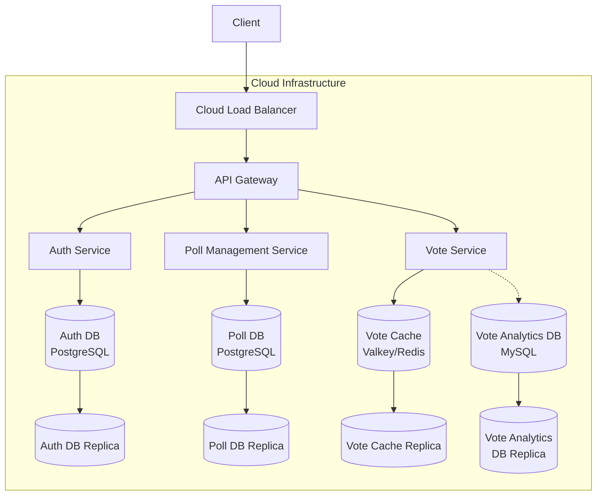
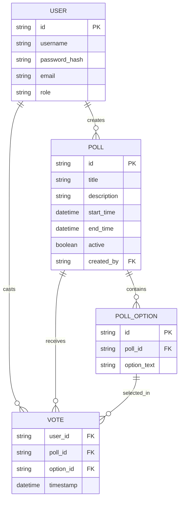

# Democratized Data - Distributed Polling System

## Project Overview

Democratized Data is a distributed polling system designed as a semester project for a distributed systems course. The system allows administrators to create polls, and users to vote on these polls. The application demonstrates key distributed systems principles including service decomposition, stateless design, data consistency, and scalability.

### Our Mission

We built Democratized Data with the belief that access to public opinion should be open and transparent. By providing a platform where everyone can vote on important matters and see the real public sentiment, we aim to democratize data and empower individuals with unfiltered insights. Our system ensures that collective voices are heard, recorded accurately, and made accessible to all, fostering a more informed and engaged society.

## Architecture

The system follows a microservices architecture with the following components:


### System Components

1. **API Gateway**: Entry point for all client requests, handles routing and authentication
2. **Auth Service**: Manages user authentication and authorization
3. **Poll Management Service**: Handles poll creation and management
4. **Vote Service**: Records and counts votes using a distributed key-value store

### System Architecture Diagram



### Data Storage Schema



## Service Descriptions

### API Gateway

The API Gateway serves as the single entry point for all client requests. It routes requests to the appropriate microservice and handles cross-cutting concerns such as:

- Authentication and authorization
- Request routing
- Header propagation
- CORS configuration

The gateway validates JWT tokens with the Auth Service and adds user information to request headers before forwarding requests to protected services.

### Auth Service

The Auth Service manages user authentication and authorization with the following features:

- User registration and login
- JWT token generation and validation
- User profile management
- Role-based access control

User credentials are securely stored with password hashing using BCrypt, and authentication is handled via JWT tokens.

### Poll Management Service

The Poll Management Service is responsible for creating and managing polls:

- Poll creation (admin only)
- Retrieving active polls
- Managing poll options
- Poll lifecycle management (start/end times)

Polls and their options are stored in a relational database with JPA/Hibernate for data access.

### Vote Service

The Vote Service handles the recording and counting of votes:

- Recording user votes
- Preventing duplicate votes
- Retrieving poll results
- Real-time vote counting
- Data persistence for analytics

The service uses Valkey (Redis-compatible) as a distributed key-value store with atomic operations and distributed locking to ensure data consistency under concurrent load. 

#### Vote Data Persistence and Analytics

While votes are initially stored in Valkey/Redis for high-performance real-time counting, they are periodically persisted to a MySQL database for long-term storage and analytics. This dual-storage approach provides several benefits:

1. **Real-time Performance**: Valkey/Redis provides in-memory operations for fast vote recording and counting during active polls.
2. **Historical Data Analysis**: Once a poll becomes inactive, vote data is transferred to MySQL where complex aggregated queries can be performed.
3. **Analytics Capabilities**: The relational structure of MySQL enables detailed analytics including:
   - Demographic analysis of voting patterns
   - Time-series analysis of voting behavior
   - Cross-poll correlation studies
   - Custom reporting and visualization

This separation of concerns allows the system to maintain high performance during active voting while still providing comprehensive analytics capabilities after polls close.

## Data Flow

### Authentication Flow

1. User registers or logs in through the Auth Service
2. Auth Service validates credentials and returns a JWT token
3. Client includes the token in subsequent requests
4. API Gateway validates the token with Auth Service
5. If valid, the request is forwarded to the appropriate service with user information

### Poll Creation Flow

1. Admin sends a poll creation request
2. API Gateway validates the admin's token
3. Request is forwarded to Poll Management Service
4. Poll Management Service creates the poll and returns the poll details

### Voting Flow

1. User sends a vote request
2. API Gateway validates the user's token
3. Request is forwarded to Vote Service
4. Vote Service checks if the user has already voted
5. If not, the vote is recorded and counted
6. Vote results are stored in Valkey (Redis)

## Technologies Used

### Backend
- **Spring Boot**: Framework for building microservices
- **Spring Cloud Gateway**: API Gateway implementation
- **Spring Data JPA**: Data access layer
- **Spring Security**: Authentication and authorization
- **JWT**: Token-based authentication
- **Redisson**: Redis client for Java
- **Valkey**: Redis-compatible distributed key-value store

### Database
- **PostgreSQL**: Relational database for Auth and Poll Management services
- **Valkey/Redis**: Distributed key-value store for Vote service

### DevOps
- **Maven**: Build and dependency management
- **Spring Actuator**: Application monitoring and management

## Distributed Systems Principles

This project demonstrates several key distributed systems principles:

1. **Service Decomposition**: The system is divided into loosely coupled microservices with specific responsibilities.

2. **Stateless Design**: Services are designed to be stateless, with state stored in databases or distributed caches.

3. **Data Consistency**: Distributed locking and atomic operations ensure data consistency under concurrent load.

4. **Scalability**: Services can be independently scaled based on demand.

5. **Fault Tolerance**: Retry mechanisms and error handling improve system resilience.

6. **API Gateway Pattern**: A single entry point handles cross-cutting concerns like authentication and routing.

## Cloud Infrastructure and Resilience

### Database Replication

All databases in the system are configured with replication to ensure fault tolerance and high availability:

1. **Primary-Replica Architecture**: Each database (PostgreSQL for Auth and Poll Management, Valkey/Redis for Vote caching, and MySQL for Vote analytics) operates in a primary-replica configuration.

2. **Automatic Failover**: If a primary database instance fails, the system automatically promotes a replica to primary status with minimal downtime.

3. **Read Scalability**: Read-heavy operations can be directed to replicas to distribute load and improve performance.

4. **Geographical Distribution**: Database replicas can be distributed across different availability zones or regions to protect against localized failures.

### Load Balancing

The system employs cloud-based load balancing to distribute traffic efficiently:

1. **Layer 7 Load Balancing**: HTTP/HTTPS traffic is distributed based on content-aware routing rules.

2. **Health Checks**: Regular health checks ensure traffic is only routed to healthy service instances.

3. **Auto-scaling Integration**: The load balancer works with auto-scaling groups to adjust capacity based on demand.

4. **SSL Termination**: SSL/TLS connections are terminated at the load balancer level, reducing computational overhead on service instances.

5. **Session Affinity**: When needed, session affinity (sticky sessions) can be enabled to ensure consistent user experience.

This cloud infrastructure design ensures the system remains available and responsive even during partial outages or traffic spikes.

## Setup Instructions

### Prerequisites
- Java 17 or higher
- Maven
- PostgreSQL
- Valkey/Redis

### Configuration

1. Clone the repository:
   ```
   git clone https://github.com/yourusername/democratizedData.git
   cd democratizedData
   ```

2. Configure database connections in each service's `application.properties` file.

3. Start Valkey/Redis:
   ```
   docker run -p 6379:6379 valkey/valkey:latest
   ```

### Running the Services

Start each service in the following order:

1. Auth Service:
   ```
   cd AuthService
   mvn spring-boot:run
   ```

2. Poll Management Service:
   ```
   cd PollManagementService
   mvn spring-boot:run
   ```

3. Vote Service:
   ```
   cd VoteService
   mvn spring-boot:run
   ```

4. API Gateway:
   ```
   cd APIGateway
   mvn spring-boot:run
   ```

The API Gateway will be available at http://localhost:8080.

## API Endpoints

### Auth Service
- `POST /auth/register`: Register a new user
- `POST /auth/login`: Login and get a JWT token
- `GET /auth/validate`: Validate a JWT token

### Poll Management Service
- `POST /api/polls`: Create a new poll (admin only)
- `GET /api/polls/active`: Get active polls

### Vote Service
- `POST /valkey/poll/save`: Save a vote for a poll
- `GET /valkey/poll/{poll_id}/get`: Get poll results

## Future Enhancements

1. **Service Discovery**: Implement service discovery for dynamic service registration and discovery
2. **Circuit Breaker**: Add circuit breaker pattern for fault tolerance
3. **Event-Driven Architecture**: Implement event-driven communication between services
4. **Containerization**: Dockerize services for easier deployment
5. **Monitoring**: Add comprehensive monitoring and alerting

## Conclusion

This project demonstrates the application of distributed systems principles in building a scalable and resilient polling system. The microservices architecture allows for independent development, deployment, and scaling of components, while the use of distributed data stores ensures data consistency and availability.

By democratizing access to polling data, we enable transparent insights into public opinion on important matters. Our architecture ensures that this data remains available, consistent, and secure through cloud-based replication, load balancing, and a carefully designed persistence strategy that balances real-time performance with analytical capabilities.
